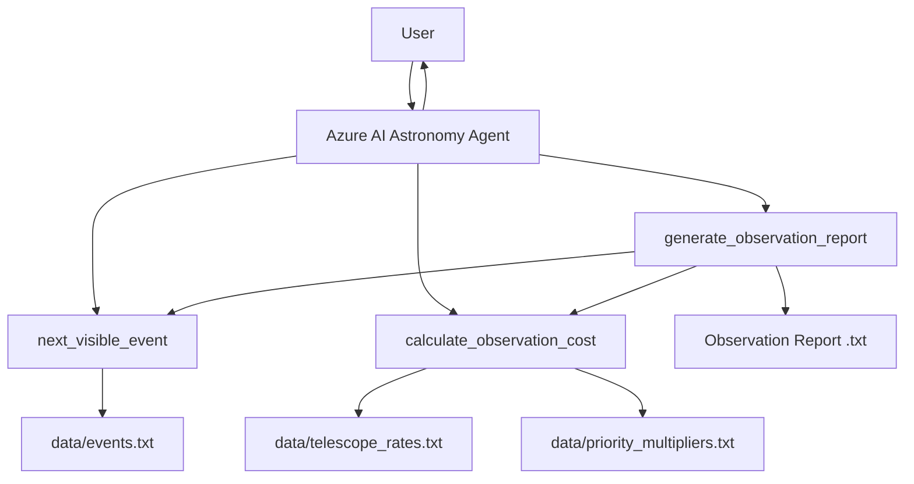
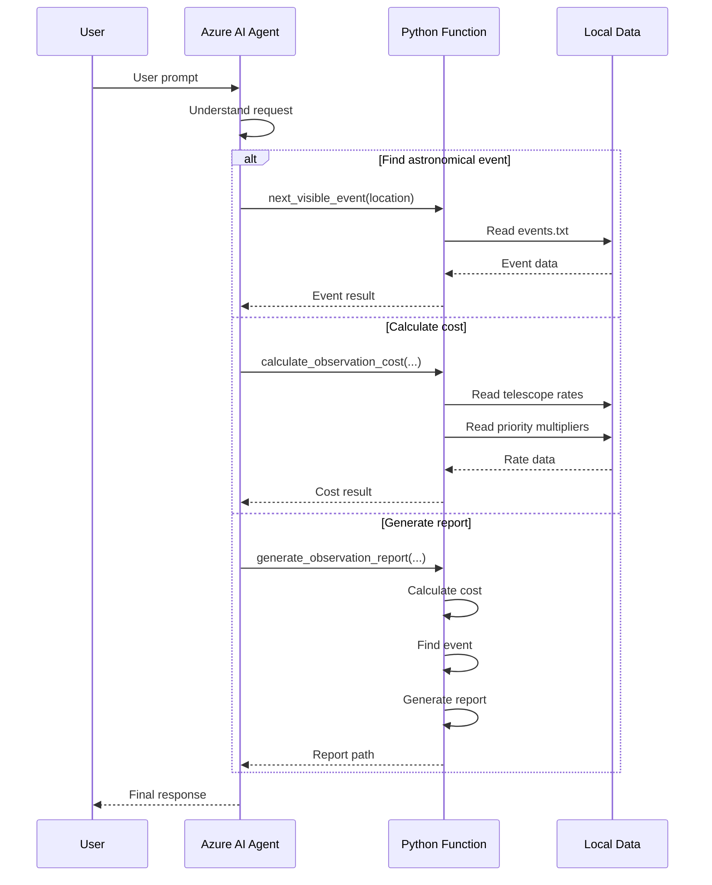

# Astronomy Observations Agent

An AI-powered astronomy observations assistant built with **Azure AI Foundry Agents** and **Azure AI Projects**.

The agent uses custom Python function tools to help users discover upcoming astronomical events, calculate telescope observation costs, and generate formal observation reports.

---

## 🚀 Features

The Astronomy Agent provides three main capabilities:

### 1. 🔭 Find the Next Visible Astronomical Event

The agent can determine the next astronomical event visible from a specified region.

Example:

```text
What’s the next major event visible in North America?
```

The agent uses the `next_visible_event()` function to search the local astronomical event dataset.

---

### 2. 💰 Calculate Telescope Observation Cost

The agent can calculate telescope rental/observation costs based on:

* Telescope tier
* Number of observation hours
* Priority level

Supported telescope tiers:

```text
standard
advanced
premium
```

Supported priorities:

```text
low
normal
high
```

Example:

```text
How much would 3 hours on a premium telescope cost at high priority?
```

The calculation uses:

```text
Base Cost = Hourly Rate × Hours

Total Cost = Base Cost × Priority Multiplier
```

---

### 3. 📄 Generate Observation Reports

The agent can generate a formal observation session report containing:

* Observation date
* Observer name
* Astronomical event
* Observation location
* Telescope tier
* Observation duration
* Priority
* Hourly telescope rate
* Priority multiplier
* Base cost
* Total cost

Example:

```text
Create an observation report for the Geminids for Bellows College.
```

The generated report is saved locally as a `.txt` file.

---

# 🏗️ Architecture



---

# 🧠 Agent Workflow

The application follows this general workflow:

```text
User
 │
 ▼
Azure AI Agent
 │
 ├── Understand user request
 │
 ├── Select appropriate function
 │
 ▼
Custom Python Function
 │
 ├── next_visible_event()
 │
 ├── calculate_observation_cost()
 │
 └── generate_observation_report()
 │
 ▼
Function Result
 │
 ▼
Azure AI Agent
 │
 ▼
Final Response
```

---

# 🛠️ Technologies Used

* Python 3.13
* Azure AI Foundry
* Azure AI Projects
* Azure AI Agents
* Azure Identity
* OpenAI Responses API
* Python `dotenv`
* Custom Python function tools
* JSON
* Local text-based datasets

---

# 📁 Project Structure

```text
03-mcp-integration/
│
└── Python/
    │
    ├── agent.py
    ├── functions.py
    ├── requirements.txt
    ├── .env
    │
    ├── data/
    │   ├── events.txt
    │   ├── telescope_rates.txt
    │   └── priority_multipliers.txt
    │
    └── report_*.txt
```

> **Note:** `.env` should not be committed to GitHub because it can contain Azure project configuration or credentials.

Recommended `.gitignore` entries:

```gitignore
.env
labenv/
.venv/
__pycache__/
*.pyc
report_*.txt
```

---

# 🔧 Custom Functions

## `next_visible_event()`

```python
next_visible_event(location: str) -> str
```

### Purpose

Finds the next astronomical event visible from the requested location.

### Input

```text
location
```

Example:

```text
north_america
```

### Output

Returns JSON containing information such as:

```json
{
    "event": "Perseid Meteor Shower",
    "type": "meteor_shower",
    "date": "08-12",
    "visible_from": [
        "north_america"
    ]
}
```

---

# 💵 `calculate_observation_cost()`

```python
calculate_observation_cost(
    telescope_tier: str,
    hours: float,
    priority: str
) -> str
```

### Purpose

Calculates the estimated cost of telescope observation time.

### Example

```text
Telescope: premium
Hours: 3
Priority: high
```

The function calculates:

```text
Base Cost = Premium Hourly Rate × 3

Total Cost =
Base Cost × High Priority Multiplier
```

It also validates:

* Telescope tier
* Priority level
* Observation hours

---

# 📑 `generate_observation_report()`

```python
generate_observation_report(
    event_name: str,
    location: str,
    telescope_tier: str,
    hours: float,
    priority: str,
    observer_name: str
) -> str
```

### Purpose

Creates a formal observation session report.

The function internally calls:

```text
calculate_observation_cost()
```

and:

```text
next_visible_event()
```

It then combines the results into a report.

Example output:

```text
======================================
  CONTOSO OBSERVATORIES - SESSION REPORT
======================================
Date:           2026-08-13 16:00
Observer:       Student
Event:          Perseid Meteor Shower
Location:       North America

NEXT VISIBLE EVENT
  Event:        Perseid Meteor Shower
  Date:         08-12

TELESCOPE BOOKING
  Tier:         premium
  Hours:        3
  Hourly Rate:  $XXX.XX
  Priority:     high
  Multiplier:   X.Xx

COST SUMMARY
  Base Cost:    $XXX.XX
  Total Cost:   $XXX.XX
======================================
```

---

# 🔐 Environment Configuration

Create a `.env` file in the Python project directory.

Example:

```env
PROJECT_ENDPOINT=<your-project-endpoint>
MODEL_DEPLOYMENT_NAME=<your-model-deployment>
```

The application loads these variables using:

```python
load_dotenv()
```

The code validates that both required variables are present before connecting to Azure.

---

# ▶️ Running the Application

## 1. Activate the virtual environment

From PowerShell:

```powershell
.\labenv\Scripts\Activate.ps1
```

Your terminal should show:

```text
(labenv) PS G:\My Drive\Azure-Projects>
```

---

## 2. Install dependencies

Use:

```powershell
python -m pip install -r requirements.txt
```

Using `python -m pip` ensures that packages are installed into the active virtual environment.

---

## 3. Authenticate with Azure

```powershell
az login
```

Make sure the authenticated account has access to the Azure AI Foundry project.

---

## 4. Run the agent

```powershell
python agent.py
```

The application will display:

```text
Enter a prompt for the astronomy agent. Use 'quit' to exit.
USER:
```

---

# 💬 Example Conversations

## Find an Astronomical Event

```text
USER:
What’s the next major event visible in North America?
```

The agent uses:

```text
next_visible_event()
```

to retrieve the event.

---

## Calculate Observation Cost

```text
USER:
How much would 3 hours on a premium telescope cost at high priority?
```

The agent uses:

```text
calculate_observation_cost()
```

to calculate the cost.

---

## Generate a Report

```text
USER:
Create an observation report for the Geminids for Bellows College.
```

The agent may request additional information such as:

```text
Location
Telescope tier
Observation hours
Priority
Observer name
```

Once the required information is available, the agent calls:

```text
generate_observation_report()
```

and creates a local report file.

---

# 🧪 Testing Performed

The following tests were successfully performed.

### Test 1 — Agent Initialization

```text
Agent created successfully
```

### Test 2 — Conversation

```text
Conversation created successfully
```

### Test 3 — Astronomy Assistant Description

The agent correctly explained that it can:

* Find upcoming astronomical events
* Estimate telescope rental costs
* Generate observation reports

### Test 4 — Tool Selection

The agent correctly understands the three available functions:

```text
next_visible_event
calculate_observation_cost
generate_observation_report
```

### Test 5 — Interactive Chat

The agent successfully accepts multiple user prompts until:

```text
quit
```

is entered.

### Test 6 — Agent Cleanup

The application deletes the agent version when the session ends:

```text
Deleted agent.
```

---

# 🔄 Function Calling Architecture

The application uses Azure AI Agent function tools.



---

# ⚠️ Current Limitations

This project currently uses local datasets:

```text
data/events.txt
data/telescope_rates.txt
data/priority_multipliers.txt
```

Therefore:

* Event information depends on the local dataset.
* Telescope prices depend on the configured rates.
* Priority multipliers depend on the local configuration.
* Generated reports are stored locally.
* The event lookup currently determines visibility based on the configured continent/location values.
* The application does not yet provide real-time astronomical calculations from an external astronomy API.

---

# 🚀 Future Improvements

Possible enhancements include:

* Real-time astronomy API integration
* Weather-aware observation planning
* Cloud coverage analysis
* Real-time astronomical event data
* GPS-based observer location
* Automatic telescope recommendations
* Web-based observation reports
* PDF report generation
* Database-backed observation history
* Email report delivery
* Calendar integration
* Multi-user authentication
* Telescope availability management
* Automated observation scheduling

---

# 🎯 Learning Outcomes

This project demonstrates how to:

1. Create an Azure AI Agent.
2. Connect an agent to Azure AI Foundry.
3. Define custom function tools.
4. Describe functions using JSON schemas.
5. Allow an AI agent to select appropriate tools.
6. Process function calls from the Responses API.
7. Return function results to the agent.
8. Generate structured responses from tool outputs.
9. Combine multiple tools into a single workflow.
10. Generate files from agent-driven function calls.
11. Manage the agent lifecycle.
12. Clean up the agent after execution.

---

# 📌 Summary

The **Astronomy Observations Agent** demonstrates a practical implementation of an AI agent that can reason about user requests and invoke custom Python functions to perform real operations.

The three core capabilities are:

```text
🔭 Astronomical Event Discovery
            +
💰 Telescope Cost Calculation
            +
📄 Observation Report Generation
            =
       Astronomy AI Agent
```

The project demonstrates the fundamentals of **tool-using AI agents**, where the language model determines which function is required and the Python application executes that function and returns the result to the agent.

---

## Status

**Azure AI Agent:** ✅ Working

**Custom Function Tools:** ✅ Working

**Event Lookup:** ✅ Working

**Cost Calculation:** ✅ Working

**Report Generation:** ✅ Implemented

**Interactive Chat:** ✅ Working

**Agent Cleanup:** ✅ Working
