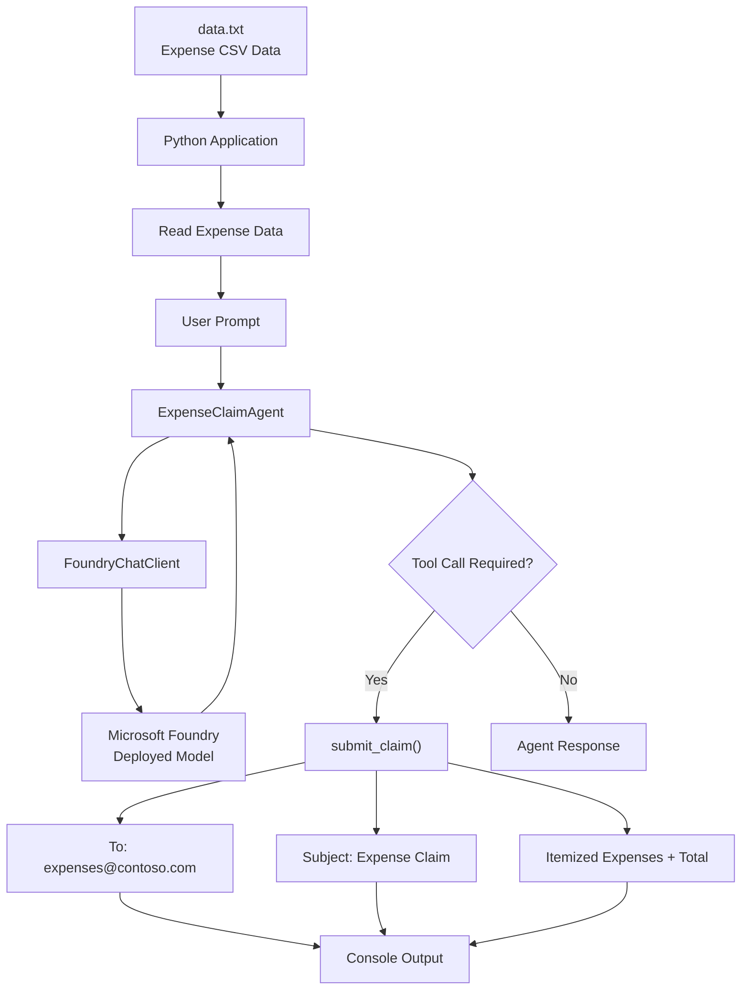
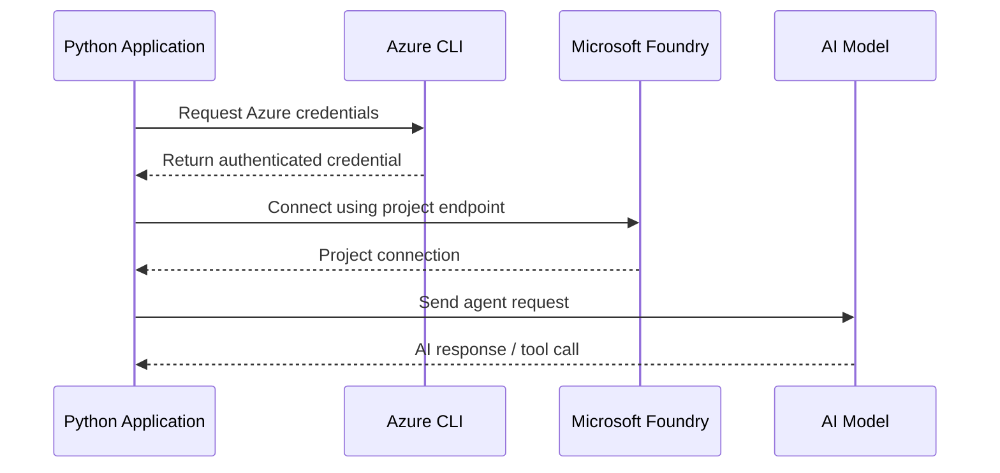
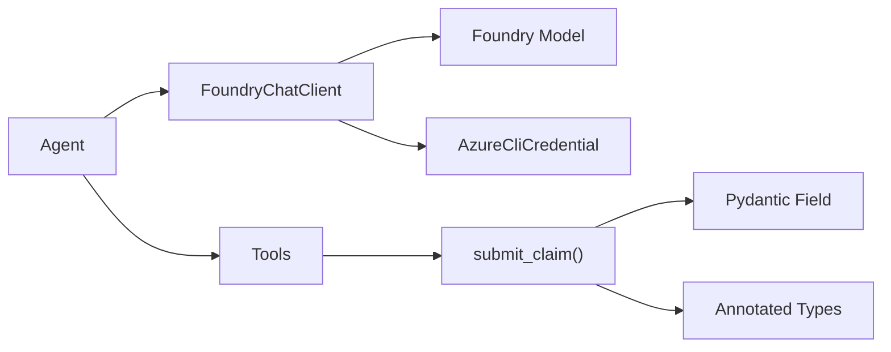
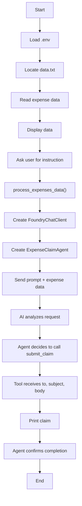
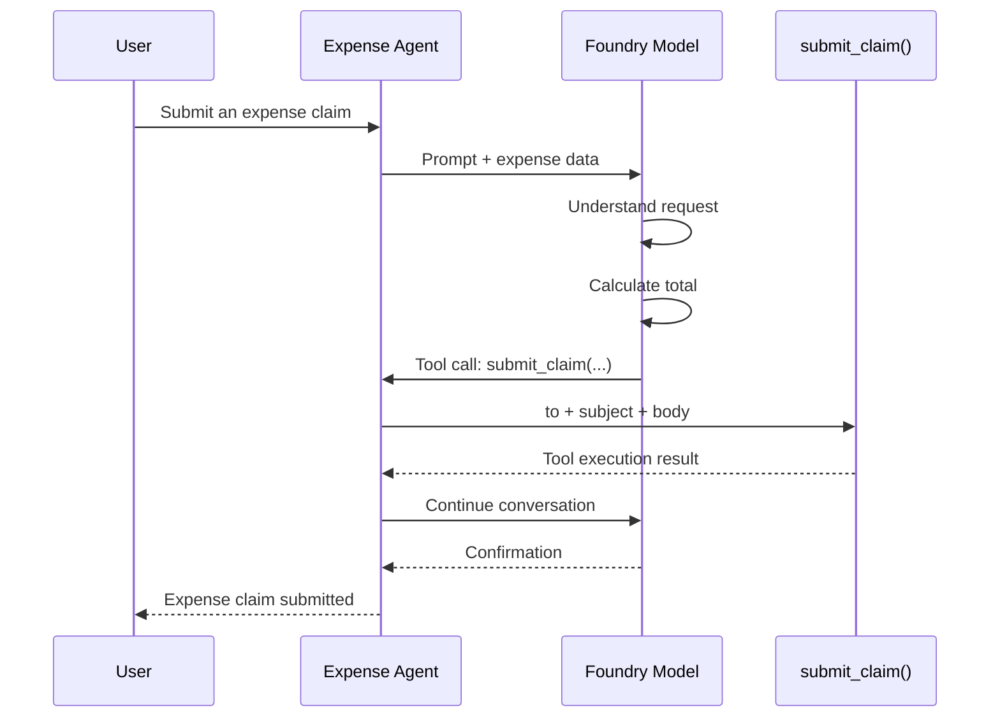
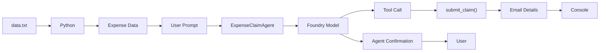
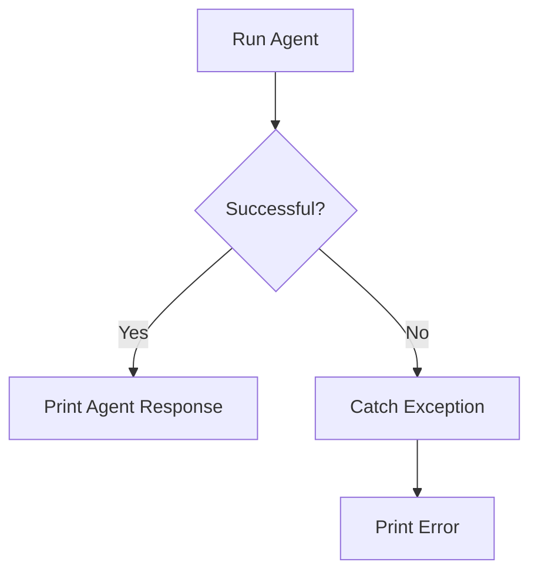
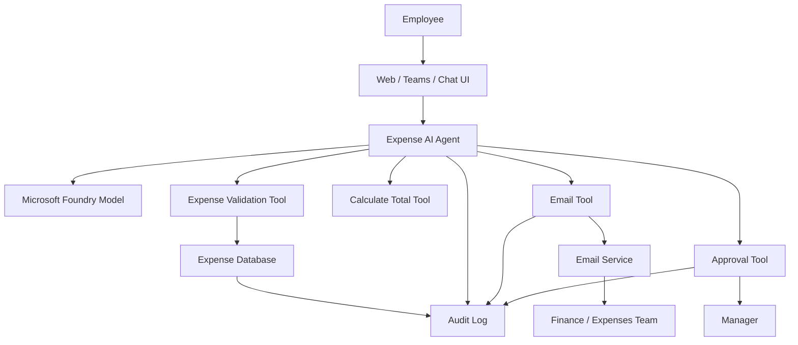

# Expense Claim Agent — README

## 1. Project Overview

This project demonstrates an **AI Expense Claim Agent** built with:

- **Microsoft Foundry** — hosts the AI model/project
- **Azure AI Agent Framework** — creates and runs the agent
- **Azure Identity** — authenticates using `AzureCliCredential`
- **Python** — application logic
- **Tool calling** — allows the agent to invoke `submit_claim()`
- **`.env`** — stores the Foundry project endpoint and model deployment name

The application reads expense data from `data.txt`, asks the user what to do with the data, and lets the AI agent create an expense claim.

---

# 2. Overall Architecture



---

# 3. Input Data

The application expects a file named:

```text
data.txt
```

Example:

```text
date,description,amount
07-Mar-2025,taxi,24.00
07-Mar-2025,dinner,65.50
07-Mar-2025,hotel,125.90
```

The three expenses are:

| Date | Description | Amount |
|---|---|---:|
| 07-Mar-2025 | Taxi | 24.00 |
| 07-Mar-2025 | Dinner | 65.50 |
| 07-Mar-2025 | Hotel | 125.90 |
| | **Total** | **215.40** |

---

# 4. Project Folder Structure

A simple project structure is:

```text
expense-agent/
│
├── main.py
├── data.txt
├── .env
├── requirements.txt
└── README.md
```

### File responsibilities

| File | Purpose |
|---|---|
| `main.py` | Main Python agent application |
| `data.txt` | Expense data |
| `.env` | Foundry configuration |
| `requirements.txt` | Python dependencies |
| `README.md` | Project documentation |

---

# 5. Environment Configuration

The application loads configuration from `.env`:

```env
PROJECT_ENDPOINT=<your-foundry-project-endpoint>
MODEL_DEPLOYMENT_NAME=<your-model-deployment-name>
```

The code loads these values using:

```python
load_dotenv()
```

Then:

```python
client = FoundryChatClient(
    project_endpoint=os.getenv("PROJECT_ENDPOINT"),
    model=os.getenv("MODEL_DEPLOYMENT_NAME"),
    credential=AzureCliCredential(),
)
```

### Authentication Flow



---

# 6. Import Section

The application starts with:

```python
import os
import asyncio
from pathlib import Path
from dotenv import load_dotenv
```

These modules provide:

### `os`

Used for operating-system operations such as clearing the terminal:

```python
os.system("cls" if os.name == "nt" else "clear")
```

### `asyncio`

Used to execute asynchronous Python functions:

```python
asyncio.run(main())
```

### `Path`

Used to construct and access the `data.txt` file:

```python
script_dir = Path(__file__).parent
file_path = script_dir / "data.txt"
```

### `load_dotenv`

Loads variables from `.env`:

```python
load_dotenv()
```

---

# 7. Agent Framework Imports

```python
from agent_framework import tool, Agent
from agent_framework.foundry import FoundryChatClient
from azure.identity import AzureCliCredential
from pydantic import Field
from typing import Annotated
```

These components have different responsibilities.



### `Agent`

Creates the AI agent.

### `FoundryChatClient`

Connects the agent to the deployed model in Microsoft Foundry.

### `AzureCliCredential`

Provides Azure authentication.

### `tool`

Converts a Python function into a tool that the AI agent can call.

### `Annotated` and `Field`

Describe the tool parameters so the model understands what each parameter means.

---

# 8. Reading the Expense File

The `main()` function starts by locating `data.txt`:

```python
script_dir = Path(__file__).parent
file_path = script_dir / "data.txt"
```

Then it reads the file:

```python
with file_path.open("r") as file:
    data = file.read() + "\n"
```

At this point:

```text
data
  │
  ▼
date,description,amount
07-Mar-2025,taxi,24.00
07-Mar-2025,dinner,65.50
07-Mar-2025,hotel,125.90
```

The application then asks:

```text
What would you like me to do with it?
```

---

# 9. User Interaction

Example:

```text
Here is the expenses data in your file:

date,description,amount
07-Mar-2025,taxi,24.00
07-Mar-2025,dinner,65.50
07-Mar-2025,hotel,125.90

What would you like me to do with it?

Submit an expense claim
```

The application receives:

```python
user_prompt
```

and passes both the prompt and expense data to:

```python
process_expenses_data(user_prompt, data)
```

---

# 10. Processing Flow



---

# 11. Creating the Foundry Client

The client is created using:

```python
client = FoundryChatClient(
    project_endpoint=os.getenv("PROJECT_ENDPOINT"),
    model=os.getenv("MODEL_DEPLOYMENT_NAME"),
    credential=AzureCliCredential(),
)
```

This connects the Python application to the deployed AI model.

### Conceptual flow

```text
Python Application
       │
       │ PROJECT_ENDPOINT
       │ MODEL_DEPLOYMENT_NAME
       │ Azure Credential
       ▼
FoundryChatClient
       │
       ▼
Microsoft Foundry
       │
       ▼
Deployed AI Model
```

---

# 12. Creating the Agent

The agent is initialized with:

```python
async with Agent(
    client=client,
    name="ExpenseClaimAgent",
    instructions=(
        "You are an AI assistant for expense claim submission. "
        "At the user's request, create an expense claim and use the "
        "plug-in function to send an email to expenses@contoso.com "
        "with the subject 'Expense Claim' and a body that contains "
        "itemized expenses with a total. "
        "Then confirm to the user that you've done so. "
        "Don't ask for any more information from the user; just use "
        "the data provided to create the email."
    ),
    tools=[submit_claim],
) as agent:
```

The important parts are:

```text
Agent
 ├── Name
 │    └── ExpenseClaimAgent
 │
 ├── Instructions
 │    └── Expense claim behavior
 │
 ├── Client
 │    └── FoundryChatClient
 │
 └── Tools
      └── submit_claim()
```

---

# 13. Agent Instructions

The instructions tell the AI what its role is.

The important requirement is:

```text
Create an expense claim
        │
        ▼
Use submit_claim()
        │
        ▼
Send to expenses@contoso.com
        │
        ▼
Subject = Expense Claim
        │
        ▼
Include itemized expenses
        │
        ▼
Include total
        │
        ▼
Confirm completion
```

This is what guides the model's tool selection.

---

# 14. Sending the Prompt to the Agent

The application creates:

```python
prompt_messages = [f"{prompt}: {expenses_data}"]
```

For example, the model may receive:

```text
Submit an expense claim:

date,description,amount
07-Mar-2025,taxi,24.00
07-Mar-2025,dinner,65.50
07-Mar-2025,hotel,125.90
```

Then:

```python
response = await agent.run(prompt_messages)
```

runs the agent.

---

# 15. Tool Calling

The most important part of this example is the tool:

```python
@tool(approval_mode="never_require")
def submit_claim(
    to: Annotated[str, Field(description="Who to send the email to")],
    subject: Annotated[str, Field(description="The subject of the email.")],
    body: Annotated[str, Field(description="The text body of the email.")],
):
    print("\nTo:", to)
    print("Subject:", subject)
    print(body, "\n")
```

The function has three inputs:

```text
submit_claim()
       │
       ├── to
       ├── subject
       └── body
```

The AI model decides how to populate those arguments based on the agent instructions and expense data.

---

# 16. Tool Calling Sequence



---

# 17. The Tool Parameters

## `to`

```python
to: Annotated[
    str,
    Field(description="Who to send the email to")
]
```

The expected value is:

```text
expenses@contoso.com
```

## `subject`

```python
subject: Annotated[
    str,
    Field(description="The subject of the email.")
]
```

Expected value:

```text
Expense Claim
```

## `body`

Contains the actual expense information:

```text
Itemized Expenses:

- 07-Mar-2025, taxi, 24.00
- 07-Mar-2025, dinner, 65.50
- 07-Mar-2025, hotel, 125.90

Total: 215.40
```

---

# 18. Important Note About `submit_claim()`

In this example, `submit_claim()` **does not actually send an email**.

It only prints the email information to the terminal:

```python
print("\nTo:", to)
print("Subject:", subject)
print(body, "\n")
```

Therefore the program demonstrates **AI tool calling**, but it does not contain a real email-sending implementation.

The architecture is:

```text
AI Agent
   │
   ▼
submit_claim()
   │
   ▼
print(...)
   │
   ▼
Terminal
```

A real production implementation would replace the `print()` statements with an email service or email connector.

---

# 19. Example Tool Output

When the tool executes, the console can show:

```text
To: expenses@contoso.com

Subject: Expense Claim

Itemized Expenses:
- 07-Mar-2025, taxi, 24.00
- 07-Mar-2025, dinner, 65.50
- 07-Mar-2025, hotel, 125.90

Total: 215.40
```

---

# 20. Agent Output

The final agent response is expected to look similar to:

```text
# Agent:

Your expense claim has been submitted to
expenses@contoso.com with the subject "Expense Claim"
and the following details:

Itemized Expenses:
- 07-Mar-2025, taxi, 24.00
- 07-Mar-2025, dinner, 65.50
- 07-Mar-2025, hotel, 125.90

Total: 215.40
```

### Important distinction

The agent says the claim was submitted, but the current Python tool only prints the email.

So technically:

```text
Current implementation:

Agent
  ↓
submit_claim()
  ↓
Terminal output

Not:

Agent
  ↓
submit_claim()
  ↓
Email Server
  ↓
Recipient Inbox
```

---

# 21. Complete Data Flow



---

# 22. Expense Calculation

The total is:

```text
24.00
+ 65.50
+ 125.90
-------
215.40
```

Therefore:

```text
Total = 215.40
```

The model can generate the itemized claim from the supplied data.

For production financial workflows, it is better to calculate totals programmatically rather than relying entirely on an LLM.

---

# 23. Error Handling

The agent execution is wrapped in:

```python
try:
    prompt_messages = [f"{prompt}: {expenses_data}"]
    response = await agent.run(prompt_messages)
    print(f"\n# Agent:\n{response}")

except Exception as e:
    print(e)
```

This prevents an exception from terminating the program without displaying the error.

The flow is:



---

# 24. Program Entry Point

At the bottom:

```python
if __name__ == "__main__":
    asyncio.run(main())
```

This means the `main()` function is executed when the file is run directly.

Example:

```bash
python main.py
```

Flow:

```text
python main.py
      │
      ▼
__main__
      │
      ▼
asyncio.run(main())
      │
      ▼
Read data.txt
      │
      ▼
Ask user
      │
      ▼
Run agent
      │
      ▼
Call tool
      │
      ▼
Display result
```

---

# 25. Why `async` Is Used

The application uses:

```python
async def main():
```

and:

```python
async def process_expenses_data(...):
```

The agent call is asynchronous:

```python
response = await agent.run(prompt_messages)
```

Therefore the application uses:

```python
asyncio.run(main())
```

Conceptually:

```text
Python
  │
  ▼
asyncio
  │
  ▼
Agent request
  │
  ▼
Foundry / Model
  │
  ▼
Response
  │
  ▼
Continue Python execution
```

---

# 26. Complete Execution Example

### Step 1 — Run the program

```bash
python main.py
```

### Step 2 — Application reads `data.txt`

```text
date,description,amount
07-Mar-2025,taxi,24.00
07-Mar-2025,dinner,65.50
07-Mar-2025,hotel,125.90
```

### Step 3 — User enters

```text
Submit an expense claim
```

### Step 4 — Agent receives

```text
Submit an expense claim:
date,description,amount
07-Mar-2025,taxi,24.00
07-Mar-2025,dinner,65.50
07-Mar-2025,hotel,125.90
```

### Step 5 — Agent decides to use the tool

```text
submit_claim(
    to="expenses@contoso.com",
    subject="Expense Claim",
    body="..."
)
```

### Step 6 — Tool prints the claim

```text
To: expenses@contoso.com
Subject: Expense Claim

Itemized Expenses:
- 07-Mar-2025, taxi, 24.00
- 07-Mar-2025, dinner, 65.50
- 07-Mar-2025, hotel, 125.90

Total: 215.40
```

### Step 7 — Agent returns confirmation

```text
Your expense claim has been submitted...
```

---

# 27. Key Concepts Demonstrated

This small project demonstrates several important AI-agent concepts:

| Concept | Where it appears |
|---|---|
| AI Agent | `Agent(...)` |
| Model client | `FoundryChatClient(...)` |
| Azure authentication | `AzureCliCredential()` |
| Environment variables | `.env` |
| Tool calling | `@tool` |
| Function parameters | `Annotated` + `Field` |
| Async execution | `async` / `await` |
| External data | `data.txt` |
| Agent instructions | `instructions=...` |
| Tool execution | `submit_claim()` |
| Error handling | `try/except` |

---

# 28. Production Architecture

For a real expense-management system, the architecture could be expanded:



This would allow the agent to:

1. Read expense reports.
2. Validate expense information.
3. Calculate totals.
4. Create expense claims.
5. Request approval.
6. Send notifications.
7. Store audit information.

---

# 29. Summary

The project follows a simple AI-agent pattern:

```text
                 ┌───────────────────┐
                 │    Expense Data   │
                 │     data.txt      │
                 └─────────┬─────────┘
                           │
                           ▼
                 ┌───────────────────┐
                 │  Python Program   │
                 └─────────┬─────────┘
                           │
                           ▼
                 ┌───────────────────┐
                 │  Expense Agent    │
                 └─────────┬─────────┘
                           │
                           ▼
                 ┌───────────────────┐
                 │  Foundry Model    │
                 └─────────┬─────────┘
                           │
                           ▼
                 ┌───────────────────┐
                 │  Tool Selection   │
                 └─────────┬─────────┘
                           │
                           ▼
                 ┌───────────────────┐
                 │  submit_claim()   │
                 └─────────┬─────────┘
                           │
                           ▼
                 ┌───────────────────┐
                 │ Expense Claim     │
                 │ Total: 215.40     │
                 └───────────────────┘
```

The core idea is:

> **The LLM decides when and how to call a Python tool, while the Python application controls the actual tool implementation.**

For this example, the tool only prints the claim. To make it a real expense-submission system, the `submit_claim()` function should be connected to an actual email or business-system API.
